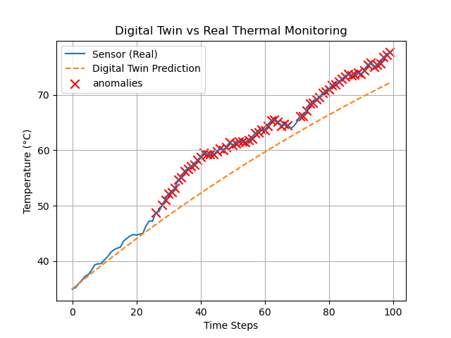

# Digital Twin Thermal Simulation with Anomaly Detection

This mini-project simulates a thermal system and applies Digital Twin modeling to predict temperature over time. It also detects anomalies when the real sensor-like data deviates significantly from the model prediction.

## 🔧 Features
Simulated real-time thermal response
Digital Twin model prediction
Anomaly detection using threshold logic
Data visualization with Matplotlib
No hardware needed (fully simulated)

## 📊 Plot Sample

## 📁 Files Included
`digital_twin.py`: main simulation code
`plot.png`: sample output
`README.md`: project overview
`LICENSE`: MIT License

## 🚀 Future Add-ons
Real-time data input using Arduino or Raspberry Pi
Live graph with streaming updates
Sensor-based Digital Twin integration

## 📜 License
MIT License
